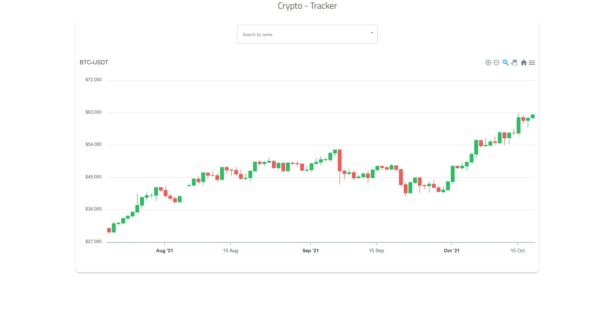

<h1 align="center">CryptoTrack</h1>

Just type any crytocurrency to get its market cap and OCHL value. The app is live at
### `https://crypotrack.herokuapp.com/`

## Features
- Built in search
- Searches the top 100 coins 🤘
- Fast in grabbing information and generating the graphs🚀
- Daily and Monthly market cap value recorded
- Responsive 😎
- Also usable on iOS & Android

## Screenshots

## Available Scripts

In the project directory, you can run:

### `yarn install`

### `yarn start` 
